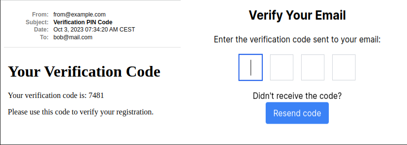

# Ruby on Rails Email Verification

## Overview

This repository demonstrates the implementation of email verification in a Ruby on Rails application using a verification code. Email verification is a vital security feature that ensures the authenticity of user accounts.

## Screenshots

 


## Getting Started

Clone this repository to your local development environment:

1. Clone the repository:

```bash
git clone https://github.com/DeVuDeveloper/email-verification.git
cd email-verification
```

2. Install the required gems:

```bash
 bundle install
 bin/setup
```

3. Set up the database:

```bash
  rails db:create
  rails db:migrate
  rails db:seed
```


4. Run the server(Open your Browser and navigate to url: http://localhost:3000/): 

```bash
  bin/dev
```


## Dependencies

The Email Verification relies on the following main dependencies:

- Ruby on Rails: The web application framework used to build the app.
- Devise: A flexible authentication solution for Rails.
- Stimulus: JavaScript framework used to enhance interactivity on web pages and applications.
- Tailwind CSS: A utility-first CSS framework for styling the app.

## Linter

The Hotel App includes a linter. You can run the linter with the following command:

```bash
  rubocop && rubocop -A
  npm run lint && npm run lint:fix
```

## Tests

The Hotel App includes a test suite using RSpec. You can run the tests with the following command:

```bash
  rspec spec
```

## Background Jobs

This project uses background jobs for efficient email verification:

- **SendPinJob:** Sends verification codes to users' email addresses.
- **UpdateUserJob:** Updates the user's verification status.

## The Verify Controller

The `VerifyController` manages the email verification process:

- **new:** Displays the verification code input form.
- **create:** Sends verification codes to user email addresses.
- **edit:** Provides a form for entering verification codes.
- **update:** Validates entered codes and marks emails as verified.

## Stimulus Controller

A Stimulus controller improves the user experience by automatically focusing on the next input field after each code digit is entered.

## License

This project is licensed under the MIT License - see the LICENSE file for details.

## Acknowledgments

This project was inspired by the need for secure user authentication.
Special thanks to the Ruby on Rails community for valuable resources and guidance.
